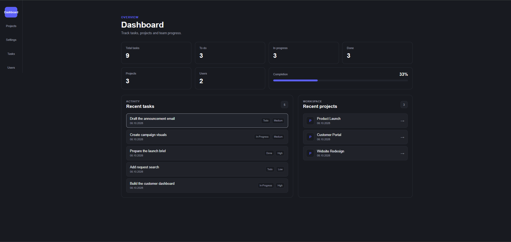
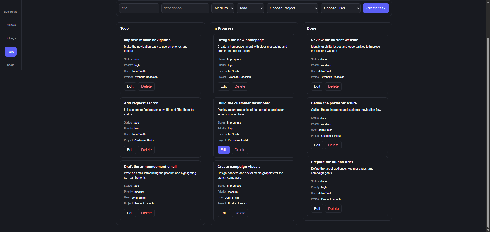
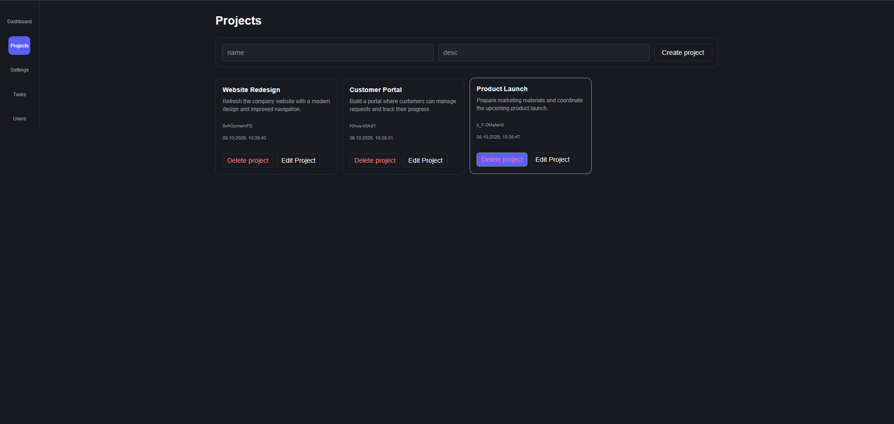

# Task Manager

A web application for managing team tasks and projects. Assign team members, set priorities, track task statuses on a Kanban board, and view overall progress on the dashboard.

## Features

- **Dashboard:** task counts by status, project and team member totals, task completion percentage, and recent tasks and projects.
- **Task management:** create, edit, and delete tasks with a title, description, priority, status, project, and assignee.
- **Kanban board:** `Todo`, `In Progress`, and `Done` columns. Change a task's status using its edit form.
- **Search and filters:** search tasks by title, filter by status and priority, and sort by creation date or alphabetically.
- **Project management:** create, edit, and delete projects; view related tasks and completion progress. Projects containing tasks cannot be deleted.
- **Team members:** browse users, view profiles with roles and contact details, and see assigned tasks.
- **Detail pages:** dedicated pages for tasks, projects, and team members.
- **Appearance:** responsive styles and light/dark themes, with the selected theme saved in `localStorage`.

## Screenshots

### Dashboard



### Kanban Board



### Projects



## Tech Stack

| Technology | Purpose |
| --- | --- |
| React 19 | Application interface |
| TypeScript | Typed data and components |
| Vite 8 | Development server and builds |
| React Router 7 | Navigation between pages |
| TanStack Query 5 | Data fetching and caching on the tasks page |
| CSS Modules | Component and page styles |
| JSON Server | Local REST API backed by `db.json` |
| Concurrently | Running the frontend and API together |
| ESLint | Code linting |

## Getting Started

### Requirements

- Node.js 22.x starting from **22.13.0**, or Node.js **24+**, to meet the requirements of Vite, JSON Server, and ESLint.
- npm.
- Git, if cloning the repository.

### Installation

```bash
git clone https://github.com/Maksymcat/task-manager.git
cd task-manager
npm ci
```

If you already have the project locally, open a terminal in its root directory and run `npm ci`.

### Start the Application and API

```bash
npm run dev:all
```

Once started:

- the application is available at [http://localhost:5173](http://localhost:5173);
- the API runs at [http://localhost:3001](http://localhost:3001).

If port `5173` is in use, Vite selects another port and prints the address in the terminal. Press `Ctrl+C` to stop the services.

You can also run the services in separate terminals:

```bash
# Terminal 1: local API
npm run server
```

```bash
# Terminal 2: frontend
npm run dev
```

## Available Scripts

| Command | Description |
| --- | --- |
| `npm run dev:all` | Starts the frontend and JSON Server together |
| `npm run dev` | Starts the Vite development server |
| `npm run server` | Starts JSON Server on port `3001` |
| `npm run build` | Checks TypeScript and creates a build in `dist/` |
| `npm run preview` | Serves the production build locally for preview |
| `npm run lint` | Checks the code with ESLint |

To preview a build, run `npm run build`, then `npm run preview`. Start the local API separately with `npm run server`.

## Data and API

JSON Server reads data from `db.json` and saves changes to the same file. The main API resources are:

| Resource | Data |
| --- | --- |
| `/tasks` | Tasks |
| `/projects` | Projects |
| `/users` | Team members |

The API URL, `http://localhost:3001`, is defined in `src/services/`. No `.env` configuration is required for local development.

Users are loaded from `db.json`; the interface supports viewing their profiles and assigned tasks. Creating a task requires a project and an assignee. Add a project on the `Projects` page, and add users to the `users` collection in `db.json`.

## Project Structure

```text
task-manager/
├── public/          # Icons and static files
├── src/
│   ├── assets/      # Images
│   ├── Components/  # Components, forms, lists, and the Kanban board
│   ├── context/     # Theme settings context
│   ├── pages/       # Application pages
│   ├── services/    # REST API requests
│   ├── types/       # Task, project, and user types
│   ├── App.tsx      # Application routes
│   └── main.tsx     # Entry point and providers
├── db.json          # Local API data
├── package.json     # Dependencies and scripts
└── vite.config.ts   # Vite configuration
```
